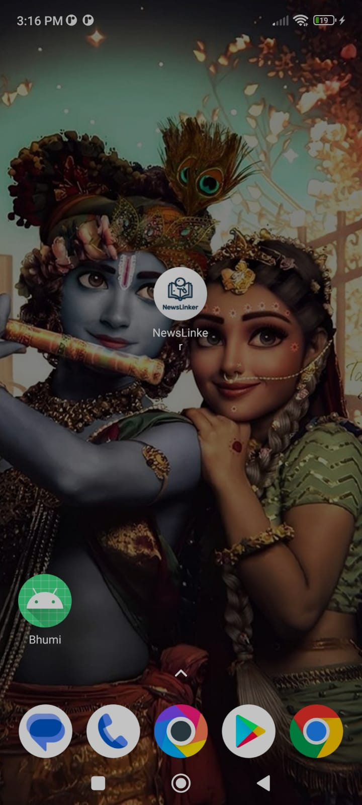

# NewsLinker

A pseudo-mobile application(Android) that should list and open 
best-outlined news articles from the app.

## Screenshots
| App pic1                            | App pic2                            |  
| ----------------------------------- | ----------------------------------- |
|  |  |
| App pic3                            | App pic4                            |  
| ----------------------------------- | ----------------------------------- |
|  |  |
| App pic5                            | App pic6                            |  
| ----------------------------------- | ----------------------------------- |
|  |  |
| App pic7                            |  
| ----------------------------------- |
|  |

## Screenshots of Firebase Dashbord

# Task Completed:
- Use of Web API to fetch news details(Do not use any 3rd party Library 
like retrofit only uses system APIs). 
API - https://candidate-test-data-moengage.s3.amazonaws.com/Android/news-api�feed/staticResponse.json
- Visually interactive design to list details.
- Implement Firebase Cloud Messaging to receive and show notifications. Make sure you are adding support for the data payload of FCM.
— Custom design, font, and icons to make the app more user-friendly. 
— Use your imagination and add features that would make things 
easier for end-users.
— Beautify; Comment; Documented code; handle Input Exceptions, 
Unicode and Null values.
— Implement a feature to sort and list articles based on old-to-new and 
new-to-old. 

## 🛠 Technologies Used

- Kotlin
- Firebase
- XML
- Android Studio
- Gradle Build System
- Version Control Systems

## SDK version

#### Minimum and Maximum SDK version

- Target SDK Version - 33
- Minimum SDK version - 21

# Demo Video Link:
https://youtu.be/5C8Q-BTdNPE?si=sfiqN61ukOFnB-V4
